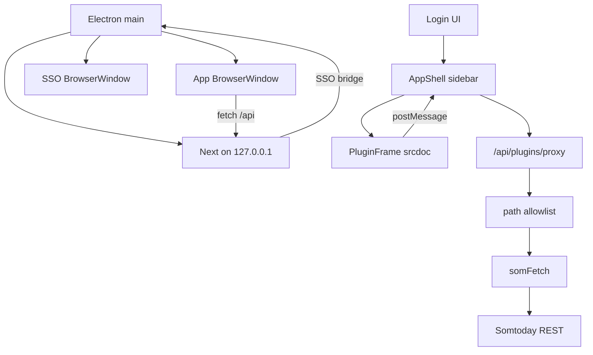

# Project Overview

`Cyfers` is an **Electron desktop app** (Next.js 15 App Router + React 19 + TypeScript)
for Dutch secondary-school students. After Somtoday login (password or school SSO), a host
shell with a sidebar loads **sandboxed plugins**. Plugins request Somtoday REST data through
a host proxy; tokens never reach plugin code.

The Electron main process starts a local Next.js server on `127.0.0.1` and opens the UI in a
`BrowserWindow`. School SSO uses a second Electron window (not Puppeteer / system Chromium).
Sessions are encrypted on disk under the app userData directory.

## Repository Structure

- `electron/` – Electron main process, preload, SSO BrowserWindow capture.
  - `electron/main.ts` – lifecycle, Next spawn, localhost SSO control bridge, autoUpdater.
  - `electron/window-state.ts` – persist/restore main window bounds + maximized/fullscreen (`userData/window-state.json`).
  - `electron/preload.ts` – `cyfersDesktop` update bridge (contextIsolation).
  - `electron/sso.ts` – school IdP login window + OAuth code capture.
- `app/` – Next.js App Router UI and API route handlers.
  - `app/page.tsx` – Login flow; post-login mounts `AppShell`.
  - `app/components/AppShell.tsx` – Sidebar shell + plugin manager.
  - `app/components/PluginFrame.tsx` – Sandboxed srcdoc iframe + postMessage bridge.
  - `app/api/plugins/` – Upload, list, enable, proxy, entry, static UI assets.
  - `app/api/{schools,method,login,session,logout}/` – Auth and school APIs.
- `lib/` – Somtoday OAuth/session helpers and plugin registry.
  - `lib/plugins/` – Manifest, allowlist match, disk registry, SDK rewrite, rate limit.
  - `lib/somtoday.ts` – OAuth, exported `somFetch`, session/plugin context.
  - `lib/browser-sso.ts` – Calls Electron SSO bridge over localhost.
  - `lib/session.ts` – httpOnly cookie + encrypted file-backed token store.
- `plugins/` – Local samples + thin ambient shim (`cyfers.d.ts`); published plugins live in `cyfer-plugins`.
- `vendor/cyfer-plugin-types/` – Vendored plugin-facing types from `cyfer-plugins/types/` (source of truth).
- `packaging/aur/cyfers-bin/` – AUR `cyfers-bin` PKGBUILD (manual pacman updates; not auto-published).
- `docs/plugins.md` – Dutch author guide for zip plugins.
- `next.config.ts`, `tsconfig.json`, `package.json` – tooling/config (electron-builder).

## Build & Development Commands

```bash
npm install
npm run dev          # Electron + Next.js (local)
npm run build        # Compile electron + next standalone
npm run pack:linux   # AppImage + deb
npm run pack:win     # NSIS installer
npm run pack:mac     # DMG + zip (updater)
npm run typecheck
npm run sync:plugin-types   # refresh vendor/ from sibling cyfer-plugins or GitHub
```

Unsigned builds may trigger Gatekeeper (macOS) or SmartScreen (Windows); code signing is a
follow-up. In-app updates use `electron-updater` against GitHub Releases (see Updates below).

## Code Style & Conventions

- TypeScript strict; React function components; path alias `@/*`.
- Match existing style (2-space indent, double quotes).
- Keep OAuth/tokens server-side; plugins talk via `cyfers` postMessage SDK only.
- Commit messages: short imperative subjects.

## Architecture Notes



1. Electron starts Next on loopback and a localhost SSO control HTTP server.
2. Student signs in; opaque `som_sid` cookie references tokens stored encrypted under userData.
3. Shell lists enabled plugins; each tab is an isolated iframe (`sandbox="allow-scripts"`).
4. Injected SDK calls `cyfers.fetch(path)`; host proxies only allowlisted `/rest/...` paths.
5. Overview is host UI; plugins come from zip upload, the marketplace (`cyfer-plugins`),
   or an unpacked **dev preview** directory (see Plugin development preview below).
   `kind: "page"` plugins are sidebar tabs, `kind: "widget"` only appear on Overview.

## Plugin development preview

Authors can load plugins from a folder (same layout as a zip: `manifest.json` + `ui/`)
without zipping on every change.

**Source resolution (server-side):**

1. If `CYFERS_PLUGIN_DEV_DIR` is set → that absolute/relative path (works in packaged
   builds too — explicit opt-in).
2. Else, only when unpackaged / `npm run dev` (`CYFERS_UNPACKAGED=1` or
   `NODE_ENV !== "production"`) → sibling `../cyfer-plugins/plugins` if it exists.
3. Packaged AppImage / installers do **not** auto-scan sibling repos.

**UI:** On the Plugins screen, section **Ontwikkeling** lists folders from that root.
**Laden** installs via symlink (fallback: copy) into the normal registry path and
enables the plugin. **Herladen** re-syncs manifest + files. File changes under a
loaded preview plugin trigger an automatic refresh of the plugin iframe (SSE +
`fs.watch`); Herladen remains available if the watcher misses an edit.

**Manual check:** clone `cyfer-plugins` next to `somtoday-login`, run `npm run dev`,
sign in → Plugins → Ontwikkeling → **Laden** on e.g. `voorbeeld-info` → edit
`ui/` → iframe updates (or click **Herladen**).

## Testing Strategy

> TODO: No automated test suite yet.

Manual: `npm run dev` → login (password and SSO) → install Cijfers from Marketplace →
Overzicht shows grades → quit/relaunch confirms session + plugins persist →
`npm run pack:linux` smoke-starts the AppImage.

Packaged builds: confirm desktop update banner after a newer GitHub Release (AppImage /
NSIS / mac zip), and Plugins screen shows **Bijwerken** / badge / **Alles bijwerken** when
catalog versions are newer.

## Updates (app + plugins)

### Desktop app (`electron-updater`)

- Packaged Electron only — `npm run dev` has no update checks.
- Feed: GitHub Releases for `samhij/somtoday-login` (`latest*.yml` + installers / mac zip /
  blockmaps uploaded by `.github/workflows/release.yml`).
- **Linux in-app channel = AppImage only** (`process.env.APPIMAGE`). `.deb`, AUR, and other
  package installs must **not** run `checkForUpdates` or show the Installeren banner —
  users update those manually via their package manager. Windows NSIS and mac zip keep
  in-app updates when packaged.
- AUR packaging lives under [`packaging/aur/cyfers-bin`](packaging/aur/cyfers-bin)
  (`cyfers-bin`): extracts the release AppImage into `/opt/cyfers` so `APPIMAGE` is unset
  and in-app updates stay off — AUR updates are manual (pacman / AUR helpers).
- Flow (supported builds): check → download in background → sticky Dutch banner → user
  clicks **Installeren** (`quitAndInstall`). **Later** dismisses; updates never install
  silently on quit (`autoInstallOnAppQuit: false`).
- **Unsigned macOS:** Squirrel.Mac cannot install. After the zip downloads, Installeren
  swaps `Cyfers.app` from the cached zip (via a post-quit `ditto` script) and relaunches.
  Signed builds still use `quitAndInstall`. Install/download failures show Dutch text on
  the banner (not only the plugins error slot).
- Preload bridge: `window.cyfersDesktop` (`getVersion`, `checkForUpdates`, `installUpdate`,
  `onUpdateEvent`). Absent outside Electron — UI no-ops safely. On unsupported Linux
  packages, `checkForUpdates` returns `ok: false` with a Dutch reason and emits no events.

### Plugin updates

- Catalog annotate (`annotateCatalog` / `isVersionNewer`) runs when the Plugins view opens,
  not only inside Marketplace.
- Plugins screen: per-row **Bijwerken**, sidebar count badge, **Alles bijwerken** when more
  than one update — all via existing `POST /api/plugins/store/install` (enabled preserved).
- Zip-only / unlisted plugins have no store update path.

### Signing follow-up

v1 ships the updater **unsigned**. Gatekeeper (macOS) and SmartScreen (Windows) may still
warn; AppImage is the most reliable unsigned channel. Code signing / notarization secrets
are intentionally out of scope for this change set.

## Security & Compliance

- Never log or commit passwords, tokens, or auth codes.
- Plugins never receive `accessToken` / `refreshToken`.
- Proxy: session required, `/rest/` only, per-plugin allowlist, size/rate limits.
- Do not add `allow-same-origin` to plugin iframes without revisiting storage isolation.
- Zip install: max 2 MB; reject path traversal and non-`ui/` files.
- Next and SSO bridge bind to `127.0.0.1` only; SSO bridge requires a one-time bearer secret.

## Agent Guardrails

- Do **not** expose tokens to the renderer or plugin iframes.
- Do **not** let plugins mutate host React/JSX.
- Do **not** relax API allowlist checks or serve arbitrary proxy hosts.
- Do **not** commit userData plugin installs or session keys.
- Prefer surgical edits; keep Dutch UI copy consistent.
- This product is Electron-only — do not reintroduce a public web deploy path.

## Extensibility Hooks

| Hook | Purpose |
| --- | --- |
| `CYFERS_DESKTOP` | Set by Electron; disables Secure cookies on localhost |
| `CYFERS_DATA_DIR` | Plugin installs + encrypted sessions (userData) |
| `CYFERS_SESSION_KEY` | AES key material for session file |
| `CYFERS_SSO_URL` / `CYFERS_SSO_SECRET` | Localhost bridge for SSO capture |
| `CYFERS_PLUGIN_STORE_URL` | Override marketplace catalog URL |
| `CYFERS_PLUGIN_DEV_DIR` | Unpacked plugins root for preview (opt-in; required in packaged builds) |
| `CYFERS_UNPACKAGED` | Set by Electron when `!app.isPackaged`; allows sibling `../cyfer-plugins/plugins` |
| `permissions.api` | Per-plugin Somtoday path globs |
| `nav.icon` | Lucide icon name rendered by host |
| `vendor/cyfer-plugin-types` | Vendored copy of `cyfer-plugins/types` (edit upstream, then `npm run sync:plugin-types`) |

## Further Reading

- [docs/plugins.md](docs/plugins.md) – plugin author guide (NL)
- [Next.js App Router](https://nextjs.org/docs/app)
- [Electron](https://www.electronjs.org/docs/latest)
- School org data: https://github.com/NONtoday/organisaties.json
