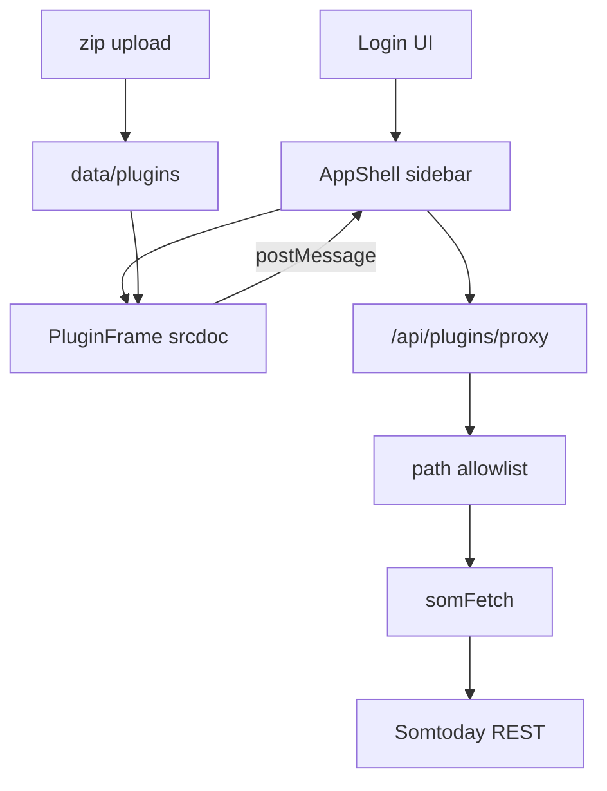

# Project Overview

`Cyfers` is a Next.js 15 (App Router) + React 19 + TypeScript app for Dutch secondary-school
students. After Somtoday login (password or school SSO), a host shell with a sidebar loads
**sandboxed plugins**. Plugins request Somtoday REST data through a host proxy; tokens never
reach plugin code. Sessions live in an in-memory store keyed by an httpOnly cookie.

## Repository Structure

- `app/` – Next.js App Router UI and API route handlers.
  - `app/page.tsx` – Login flow; post-login mounts `AppShell`.
  - `app/components/AppShell.tsx` – Sidebar shell + plugin manager.
  - `app/components/PluginFrame.tsx` – Sandboxed srcdoc iframe + postMessage bridge.
  - `app/api/plugins/` – Upload, list, enable, proxy, entry, static UI assets.
  - `app/api/{schools,method,login,session,logout}/` – Auth and school APIs.
- `lib/` – Somtoday OAuth/session helpers and plugin registry.
  - `lib/plugins/` – Manifest, allowlist match, disk registry, SDK rewrite, rate limit.
  - `lib/somtoday.ts` – OAuth, exported `somFetch`, session/plugin context.
- `plugins/` – First-party plugin sources (`widget-cijfers`, `voorbeeld-info`).
- `data/plugins/` – Installed plugin copies + `index.json` (gitignored).
- `docs/plugins.md` – Dutch author guide for zip plugins.
- `next.config.ts`, `tsconfig.json`, `package.json` – tooling/config.

## Build & Development Commands

```bash
npm install
npm run dev
npm run build
npm run start
npx tsc --noEmit
```

> TODO: Add lint, test, debug, and deploy npm scripts when tooling is introduced.
> SSO login needs a Chromium binary (see `CHROMIUM_PATH` under Extensibility Hooks).

## Code Style & Conventions

- TypeScript strict; React function components; path alias `@/*`.
- Match existing style (2-space indent, double quotes).
- Keep OAuth/tokens server-side; plugins talk via `cyfers` postMessage SDK only.
- Commit messages: short imperative subjects.

## Architecture Notes



1. Student signs in; opaque `som_sid` cookie references in-memory tokens.
2. Shell lists enabled plugins; each tab is an isolated iframe (`sandbox="allow-scripts"`).
3. Injected SDK calls `cyfers.fetch(path)`; host proxies only allowlisted `/rest/...` paths.
4. Built-in `widget-cijfers` is synced from `plugins/widget-cijfers` on registry read.
   Overview is host UI; `kind: "page"` plugins are sidebar tabs, `kind: "widget"` only
   appear on Overview.

## Testing Strategy

> TODO: No automated test suite yet.

Manual: login → Overzicht tab loads students/grades → Plugins upload `voorbeeld-info` zip →
toggle/disable → confirm proxy rejects undeclared paths.

## Security & Compliance

- Never log or commit passwords, tokens, or auth codes.
- Plugins never receive `accessToken` / `refreshToken`.
- Proxy: session required, `/rest/` only, per-plugin allowlist, size/rate limits.
- Do not add `allow-same-origin` to plugin iframes without revisiting storage isolation.
- Zip install: max 2 MB; reject path traversal and non-`ui/` files.

## Agent Guardrails

- Do **not** expose tokens to the client or plugin iframes.
- Do **not** let plugins mutate host React/JSX.
- Do **not** relax API allowlist checks or serve arbitrary proxy hosts.
- Do **not** commit `data/` plugin installs or secrets.
- Prefer surgical edits; keep Dutch UI copy consistent.

## Extensibility Hooks

| Hook | Purpose |
| --- | --- |
| `CHROMIUM_PATH` | Chromium for SSO |
| `plugins/*/manifest.json` | First-party plugin definitions |
| `permissions.api` | Per-plugin Somtoday path globs |
| `nav.icon` | Lucide icon name rendered by host |
| `data/plugins/` | Runtime installs |

## Further Reading

- [docs/plugins.md](docs/plugins.md) – plugin author guide (NL)
- [Next.js App Router](https://nextjs.org/docs/app)
- School org data: https://github.com/NONtoday/organisaties.json
