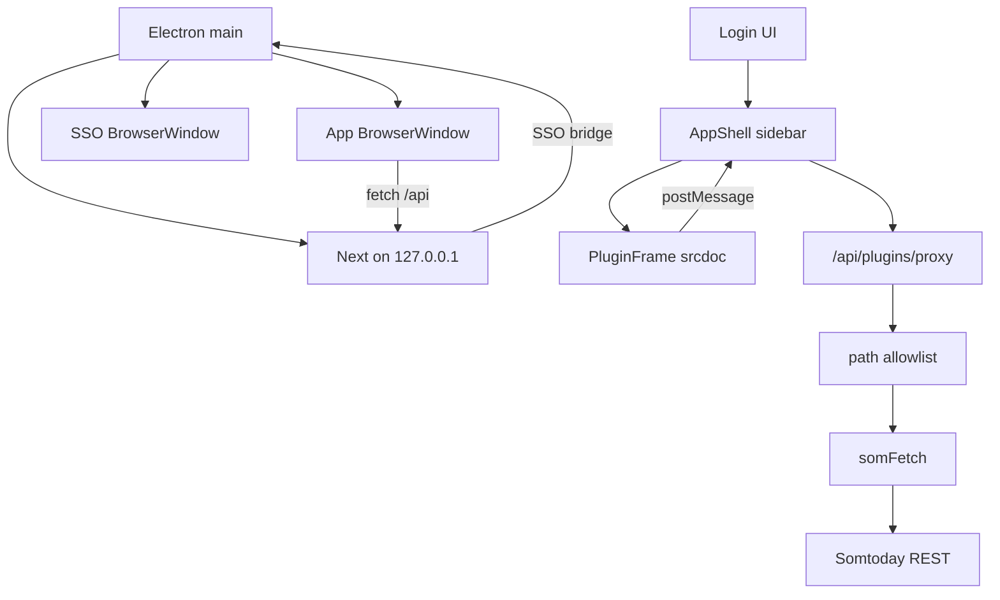

# Project Overview

`Cyfers` is an **Electron desktop app** (Next.js 15 App Router + React 19 + TypeScript)
for Dutch secondary-school students. After Somtoday login (password or school SSO), a host
shell with a sidebar loads **sandboxed plugins**. Plugins request Somtoday REST data through
a host proxy; tokens never reach plugin code.

The Electron main process starts a local Next.js server on `127.0.0.1` and opens the UI in a
`BrowserWindow`. School SSO uses a second Electron window (not Puppeteer / system Chromium).
Sessions are encrypted on disk under the app userData directory.

## Repository Structure

- `electron/` – Electron main process, preload, SSO BrowserWindow capture.
  - `electron/main.ts` – lifecycle, Next spawn, localhost SSO control bridge.
  - `electron/sso.ts` – school IdP login window + OAuth code capture.
- `app/` – Next.js App Router UI and API route handlers.
  - `app/page.tsx` – Login flow; post-login mounts `AppShell`.
  - `app/components/AppShell.tsx` – Sidebar shell + plugin manager.
  - `app/components/PluginFrame.tsx` – Sandboxed srcdoc iframe + postMessage bridge.
  - `app/api/plugins/` – Upload, list, enable, proxy, entry, static UI assets.
  - `app/api/{schools,method,login,session,logout}/` – Auth and school APIs.
- `lib/` – Somtoday OAuth/session helpers and plugin registry.
  - `lib/plugins/` – Manifest, allowlist match, disk registry, SDK rewrite, rate limit.
  - `lib/somtoday.ts` – OAuth, exported `somFetch`, session/plugin context.
  - `lib/browser-sso.ts` – Calls Electron SSO bridge over localhost.
  - `lib/session.ts` – httpOnly cookie + encrypted file-backed token store.
- `plugins/` – First-party plugin sources (`widget-cijfers`, `voorbeeld-info`).
- `docs/plugins.md` – Dutch author guide for zip plugins.
- `next.config.ts`, `tsconfig.json`, `package.json` – tooling/config (electron-builder).

## Build & Development Commands

```bash
npm install
npm run dev          # Electron + Next.js (local)
npm run build        # Compile electron + next standalone
npm run pack:linux   # AppImage + deb
npm run pack:win     # NSIS installer
npm run pack:mac     # DMG
npm run typecheck
```

Unsigned builds may trigger Gatekeeper (macOS) or SmartScreen (Windows); code signing is a
follow-up.

## Code Style & Conventions

- TypeScript strict; React function components; path alias `@/*`.
- Match existing style (2-space indent, double quotes).
- Keep OAuth/tokens server-side; plugins talk via `cyfers` postMessage SDK only.
- Commit messages: short imperative subjects.

## Architecture Notes



1. Electron starts Next on loopback and a localhost SSO control HTTP server.
2. Student signs in; opaque `som_sid` cookie references tokens stored encrypted under userData.
3. Shell lists enabled plugins; each tab is an isolated iframe (`sandbox="allow-scripts"`).
4. Injected SDK calls `cyfers.fetch(path)`; host proxies only allowlisted `/rest/...` paths.
5. Built-in `widget-cijfers` is synced from packaged `plugins/widget-cijfers` on registry read.
   Overview is host UI; `kind: "page"` plugins are sidebar tabs, `kind: "widget"` only
   appear on Overview.

## Testing Strategy

> TODO: No automated test suite yet.

Manual: `npm run dev` → login (password and SSO) → Overzicht loads students/grades →
Plugins upload `voorbeeld-info` zip → quit/relaunch confirms session + plugins persist →
`npm run pack:linux` smoke-starts the AppImage.

## Security & Compliance

- Never log or commit passwords, tokens, or auth codes.
- Plugins never receive `accessToken` / `refreshToken`.
- Proxy: session required, `/rest/` only, per-plugin allowlist, size/rate limits.
- Do not add `allow-same-origin` to plugin iframes without revisiting storage isolation.
- Zip install: max 2 MB; reject path traversal and non-`ui/` files.
- Next and SSO bridge bind to `127.0.0.1` only; SSO bridge requires a one-time bearer secret.

## Agent Guardrails

- Do **not** expose tokens to the renderer or plugin iframes.
- Do **not** let plugins mutate host React/JSX.
- Do **not** relax API allowlist checks or serve arbitrary proxy hosts.
- Do **not** commit userData plugin installs or session keys.
- Prefer surgical edits; keep Dutch UI copy consistent.
- This product is Electron-only — do not reintroduce a public web deploy path.

## Extensibility Hooks

| Hook | Purpose |
| --- | --- |
| `CYFERS_DESKTOP` | Set by Electron; disables Secure cookies on localhost |
| `CYFERS_DATA_DIR` | Plugin installs + encrypted sessions (userData) |
| `CYFERS_BUILTIN_PLUGINS` | Packaged first-party plugin sources |
| `CYFERS_SESSION_KEY` | AES key material for session file |
| `CYFERS_SSO_URL` / `CYFERS_SSO_SECRET` | Localhost bridge for SSO capture |
| `plugins/*/manifest.json` | First-party plugin definitions |
| `permissions.api` | Per-plugin Somtoday path globs |
| `nav.icon` | Lucide icon name rendered by host |

## Further Reading

- [docs/plugins.md](docs/plugins.md) – plugin author guide (NL)
- [Next.js App Router](https://nextjs.org/docs/app)
- [Electron](https://www.electronjs.org/docs/latest)
- School org data: https://github.com/NONtoday/organisaties.json
